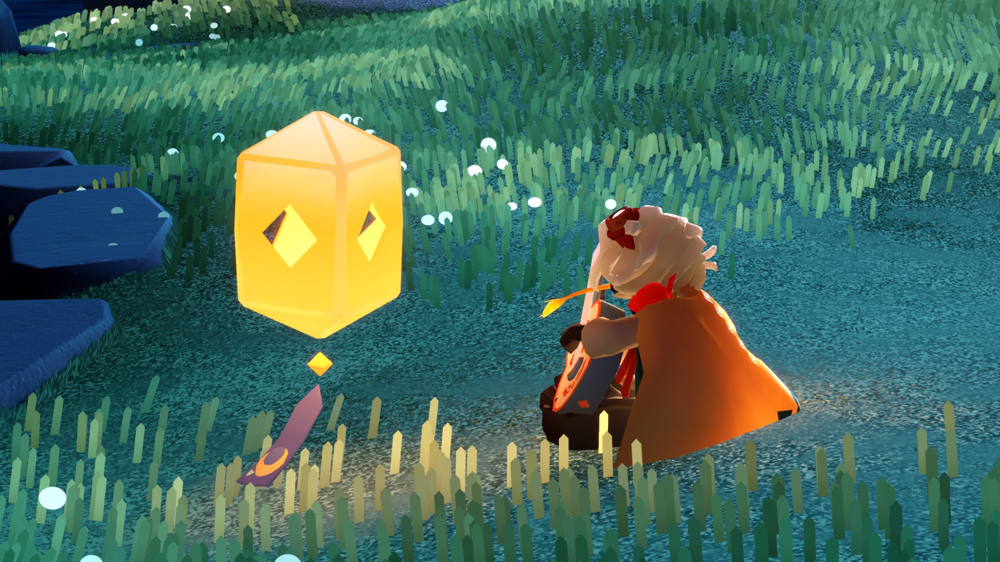
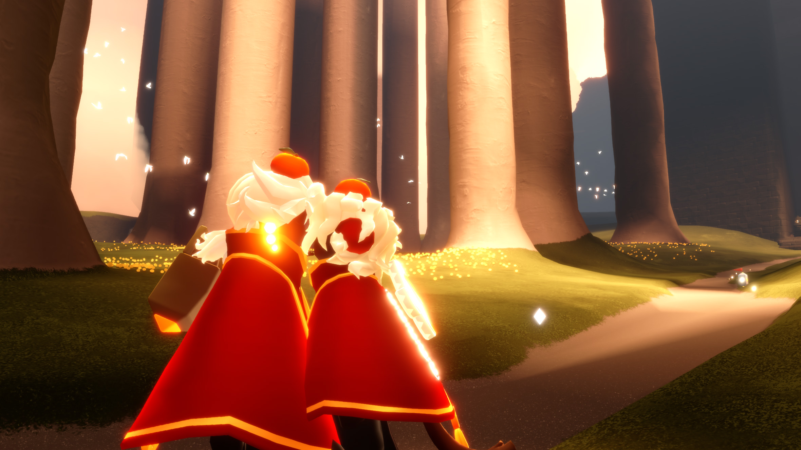

# To-White-Happy-Birthday
/#
<!DOCTYPE html>
<html lang="zh-CN">
<head>
  <meta charset="UTF-8">
  <meta name="viewport" content="width=device-width, initial-scale=1.0, maximum-scale=1.0, user-scalable=yes">
  <title>🎂 彼，生日快乐！</title>
  <!-- 艺术字体 -->
  <link href="https://fonts.googleapis.com/css2?family=Dancing+Script:wght@700&family=ZCOOL+KuaiLe&display=swap" rel="stylesheet">
  
</head>
<body>

  

    <!-- 1. 花之日 -->
    

      
🌸 花之日

      

    

    <!-- 2. 小王子 · B612 -->
    

      
🌟 小王子 · B612

      

    

    <!-- 3. 四叶草 -->
    

      
🍀 四叶草

      

    

    <!-- 4. INFP & ISTJ -->
    

      
💫 INFP & ISTJ

      

    

    <!-- 5. 偷拍 -->
    

      
📸 偷拍

      

    

    <!-- 6. 睡觉时间到 -->
    

      
😴 睡觉时间到

      

    

    <!-- 7. 训练程子 + 全屏祝福 + 烟花 -->
    

      
🏋️ 训练程子

      

      <!-- 全屏祝福层 -->
      

        <h1>🎂 生日快乐</h1>
        
愿你的世界永远有花、有光、 有期待新一天到来的理由

      

      <canvas id="fireworks-canvas"></canvas>
    

  

  <!-- 导航箭头 -->
  
‹

  
›

  <!-- 底部提示 -->
  

    <i>⬅️</i> 左右方向键切换 <i>➡️</i>
  

<!-- 背景音乐 -->
<audio id="bgMusic" autoplay loop preload="auto">
  <source src="music.mp3" type="audio/mpeg">
  您的浏览器不支持音频播放。
</audio>

</body>
</html>
